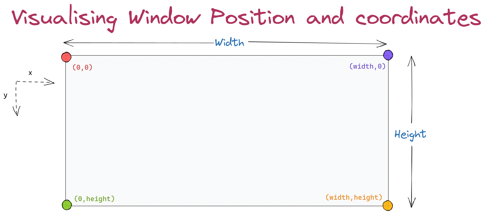

# Basic OpenGL Tutorial / Tips
- The resource which I am using is https://ogldev.org/www/tutorial01/tutorial01.html
- I will be using `Ubuntu 20.04`. It is much easier to make a Linux Virtual machine and then execute OPENGL instead of doing it in windows

## Compiling The C File 
- To use OpenGL, we need to compile the program using `g++` or `gcc`

- `g++ {code_file_name.c} -lGL -lGLU -lglut -o {output_file_name.out}`
	- Replace `{code_file_name.c}` with the `C` file
	- Replace `{output_file_name.out}` with the name you wish to give the output file
	

## Headers Required
For accessing OpenGL : `#include "GL/freeglut.h"`

-------------------------------------------------------------------
# Initialisation and Display Mode
## Initialisation
- The OpenGL is initialised in a program using the `glutInit()` function
- To use this command, we need to accept command line paramters through `main()`:
	- [Read about command line arguments here](https://www.geeksforgeeks.org/command-line-arguments-in-c-cpp/)
- The syntax is as follows: `glutInit(int &argc,char** argv)`:
	- `int& argc` : We need to pass the address of `argc` which we capture from `main()` function.
	- `char** argv` : The actual command line parameters (strings) which we pass to the program
- Without this, an OpenGL program will not execute

## Display Mode (GLUT_DOUBLE)
-------
`NOTE : WE WILL USE GLUT_SINGLE FOR COLLEGE PURPOSES HOWEVER THIS IS USEFUL TO KNOW`
-------
- For practical purposes, we use the `GLUT_DOUBLE` flag to enable **Double Buffers**
- [Original Link to understand basics of Double BUffers](https://www2.cs.arizona.edu/classes/cs433/spring02/opengl/dblbuffer.html)
- In simple terms, Double Buffer consists of two buffers called the `Front Buffer` and `Back Buffer`

| Front Buffer                                       | Back Buffer                         |
| ----------------------------------                 | ----------------------------------- |
| The contents of this buffer is displayed on screen | The GPU writes on this buffer       |
| User views this buffer                             | User does not view this buffer      |

- After completion of each frame, the buffers are swapped AND therefore, the Fron Buffer becomes Back buffer and Back buffer becomes front buffer
- This is an efficient way of displaying graphics
- (This swap is done through a callback function which will be discussed later)

## Display Mode (GLUT_RGBA)
- This is basically telling OpenGL to use RGBA color scheme
- To experiment with RGBA scehme, [Use this website](https://rgbacolorpicker.com/)
- Each color is represented in the combination of **R**ed, **G**reen, **B**lue,**A**lpha:
	- Alpha means the transparency of the color
	- In original scale, a value of `256` means full color. For example, `R = 256` meant "express red color fully"
	- A value of `1` means "Do not express the color". This means the resultant color is black
	- For computer purposes (the counting being 0 indexed), we assume `0` = Black and `255` = Full Color
- For OpenGL,the values are clamped between **0 to 1**: 
	- Divide the original values by `256`
	- Then we will obtain the clamped value

- The code to set these parameters is as follows: `glutInitDisplayMode(GLUT_DOUBLE | GLUT_RGBA)`
--------------------------------------------------------------------
# Creating Window
## Window Size
- As the name suggests, we are defining the size of the window which we have to create
- The function which is used is `glInitWindowSize(int width,int height)`:
	- As the name of variable suggests, `width` and `height` of the window are to be supplied

## Window Position
- As the name suggests, we are defining the position of the window which we have to create
- The function which is used is `glInitWindowPosition(int x,int y)`:
	- As the name of variable suggests, `x` coordinate and `y` coordinate of the window are to be supplied
- This diagram can help visualise the coordinate axis of the "window"
- This can be used to position the window which we will create:
	- Origin is the top-left corner
	- As we move downward, the `Y` coordinate increases
	- As we move right, the `X` coordinate increases


## Creating the Window
- This step is easy: we will simply use the `glutCreateWindow(char* name)` to create the window
- The `name` can be simply provided in `" "` (see the code above for example)
- The function returns a handle (integer):
	- This handle is used to access the window
	- Kind of like an identifier for a particular window
--------------------------------------------------------------------
## glutDisplayFunc()
- This is the function which we will call for displaying the "graphics" we want on the screen
- The function which we will send in this is called the `Callback Function`
- 

---------------------------------
## glutMainLoop()
- This will keep the program running until user closes the window
- This should be the second last line in `main()` (before `return 0`)
- Equivalent to 
- 
```
while True:
	if userCloses():
		break
```
-----------------------------------
## glClearColor()
- Used to set the background color
- Defined as `glClearColor(float red, float green, float blue, float alpha)`:
	- Uses the RGBA color scheme
	- `alpha = 0` means **Opaque Background**
	- `alpha = 1` means **Transparent Background**
- A list of basic background colors is given as follows

| RGBA Values                           | Resulting Color                           |
| :-----------------------------------: | :---------------------------------------: |
| (0.0,0.0,0.0,0.0)                     | Black                                     |
| (1.0,0.0,0.0,0.0)                     | Red                                       |
| (0.0,1.0,0.0,0.0)                     | Green                                     |
| (0.0,0.0,1.0,0.0)                     | Blue                                      |
| (1.0,1.0,1.0,0.0)                     | White                                     |


