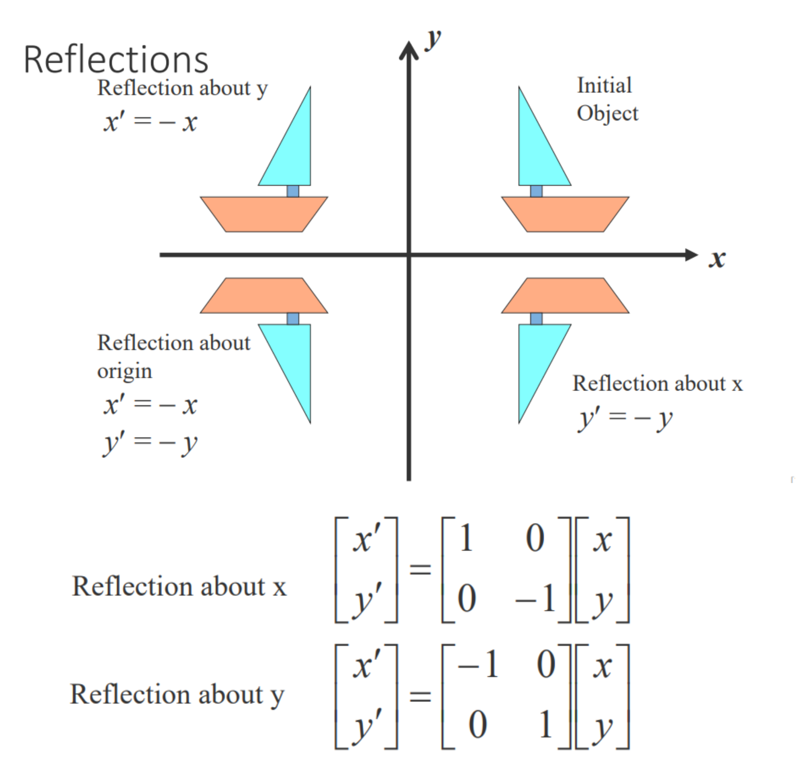

# Translation, Scaling and Rotation
# [Refer Slides](https://lms.thapar.edu/moodle/pluginfile.php/280262/mod_resource/content/1/2-D%20Transformations.pdf)
## Translation
### [Theory](https://youtu.be/n85QQy03_gI)
- Translation here means `change in location of a point`:
> Does not mean "convert from one language to other"

- This can be done easily: Just add an offset `tx` to `x` coordinate and `ty` to `y` coordinate:
	- `x' = x + tx`
	- `y' = y + ty`
- In matrix form, it is equivalent to:

### [Numerical](https://youtu.be/mzX6K0ATJRs)

--------------------------------------------------
## Scaling
### [Theory](https://youtu.be/eLmBR2HyLPo)
- It is used to either increase or decrease the size of the "graphic"
- The `x` and `y` coordinates are multiplied by a constant `sx` and `sy` respectively:
	- If `sx` and `sy` > 1, then size increases
	- If `sx` and `sy` < 1, then size decreases
	- If `sx` and `sy` = 1, then no change in size
	- If `sx` and `sy` are equal, then the change is uniform based on the values of `sx` and `sy` as discussed above
- The new coordinates after scaling `x'` and `y'` are determined as follows:
	- `x' = x * sx`
	- `y' = y * sy`

- The matrix form of scaling is represented as follows

### [Numerical](https://youtu.be/C2NaUGG_tns)

### Scaling About A Fixed Point
- The scaling which we have discussed above is performed when we consider scaling about the origin
- To scale about a fixed point, we do the following steps:
	- Translate the point to origin
	- Scale about the origin
	- Translate back to the fixed point
- The image below will explain succintly

--------------------------------------------------
## Rotation
### [Theory Part 1](https://youtu.be/fXyrffB69gI) **AND** [Theory Part 2](https://youtu.be/y8MNTRyn8pI)
- The videos above contain the proof for Algebraic form of rotation
- The results are given as follows

### [Numerical](https://youtu.be/p_iN8I6dM7Y)

### Matrix Formula
- The matrix formula for rotation can be described as follows

## Rotation About Pivot Point
- As such with scaling, we rotate the "figure" with respect to origin
- The origin acts as the **pivot point**:
	- Pivot point is the point of rotation
	- The pivot point need not be on the object
- If we are supposed to rotate the object from a pivot point, we will do it as follows:
	- Translate the pivot point to origin
	- Rotate the "figure" with respect to origin
	- Translate the rotated "figure" back
- This may explain 

--------------------------------------------------

# Shearing and Reflection
## Reflection
[Theory](https://youtu.be/ojteOGAqdmA)
- The best way to understand reflection is to see it

[Numerical](https://youtu.be/F6YfTc3f-mQ)

## Shearing
[Theory](https://youtu.be/VnRtEtnruBw)

[Numerical](https://youtu.be/uBPHATW5KEk)

--------------------------------------------------
# Homogenous Coordinate
[Theory](https://youtu.be/rZUw02zBoDI)
- Simplifies operations performed on Graphics
- We add another attribute (coordinate) called `w` coordinate and another row
- This provides a consistent and uniform way of handling `affine transformations`:
	- Affine transformation is an invertible and linear transformation
	- Preserves linearity of segments
	- Preserves parralelism between lines
- There is a way to visualise Homogenous Coordinates as follows [Affine Transformations and Homogenous Coordinates](https://youtu.be/E3Phj6J287o)
- After using the homogenous coordinate system, the basic transformations are as follows

--------------------------------------------------
# Composite Transformations
- Used to combine the results of multiple transformations into one
- Since we are acheiving the transformations using matrices, it's just a series of multiplications which will give us with a matrix that can be used to obtain the final coordinates after `n` transformations
- NOTE : Order of transformations and Order of matrix multiplication is **reverse**. The image below will explain succintly

## Numerical
- [ ] [Scaling About Fixed Point](https://youtu.be/J79MOSWgxTk)

# Reflecting An Object About A Line L

## THE VALUE OF mL is a result, remember it

## Numerical

