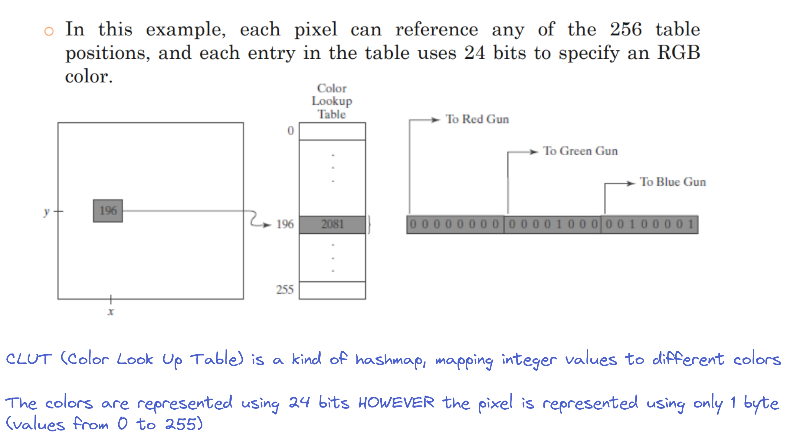

# Color Lookup Tables (CLUT)
## https://youtu.be/3PhdMTi-nn0
- An optimisation technique to represent colors in an application with comparatively less amount of resources
- To represent each pixel, we use 3 cells:
	- A cell for representing Red color **R**
	- A cell for representing Blue Color **B**
	- A cell for representing Green Color **G**
- The number of bits which are used to represent each cell, the more variety of colors we can have
- To calculate number of different colors formed from RGB cells, use the formula `2^(3*n)`:
	- `n` = Number of bits used to represent each cell
- The following table lists some values of `n` and number of colors obtained and Size of "each" pixel

| Value of `n`          | Number of colors            | Size of each pixel    |
| --------------------- | --------------------------- | --------------------- |
| 1                     | `2^(3) = 8`                 | 3 bits                |
| 2                     | `2^(6) = 64`                | 6 bits                |
| 8                     | `2^(24) ~= 17 million`      | 24 bits or 3 bytes    |

# Using Color Tables To Reduce size of frame buffer
- We can use color tables (or color lookup tables) to reduce size of frame buffer to repersent different colors
- Often, we can use 256 values (indices) to represent different colors and shades of colors
- It is represented as follows

- This reduces the color pallete of nearly 17 million to 256 colors however, size of each pixel gets reduced to `1` byte
- Furthermore, this `CLUT` can be changed to represent totally different colors without actually changing any value in the original "graphic":
	- This is done by chaning the CLUT which points to different colors
	- For example, change from RGB system to CMYK (Cyan, Magenta,Yellow,Black) can be achieved by using different CLUT without any noticeable change in performance [Different Color Systems](https://www.colormatters.com/color-and-design/color-systems-rgb-and-cmyk)

# Obtaining Grayscale using RGB
- Shades of gray are called "grayscale"
- Whenever value of `R`,`G` and `B` are equal, we get a shade of "gray":
	- Values closer to 0 will return a "dark" shade of gray
	- Values closer to 1 will return a "Light" shade of gray
