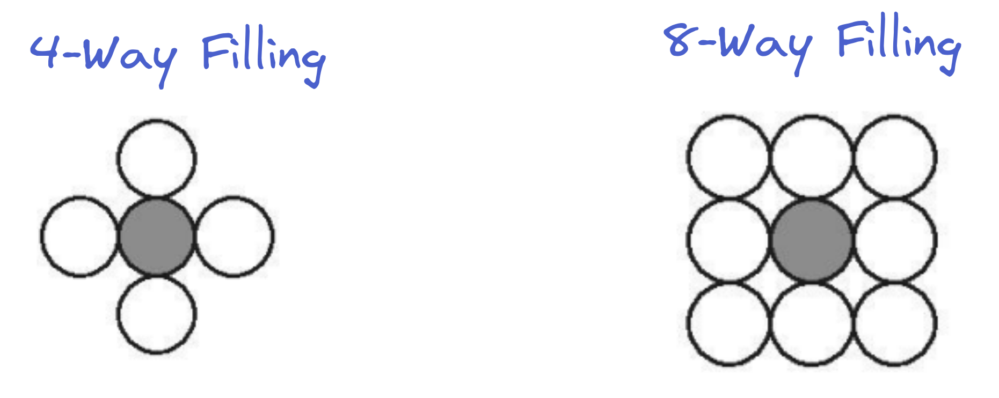

# Boundary Fill Algorithm
- It is just DFS with some changes
- DFS = Depth First Search in Adjacency Matrix representation of a graph
- Video Used : [Part 1](https://www.youtube.com/watch?v=fL5WZgLvl88) [Part 2](https://www.youtube.com/watch?v=ALgC7ptPS5g)

# 4 Way Filling vs 8 Way Filling
- In boundary fill algorithm, the fundamental concept is to fill the adjacent cells
- The adjacent cells can be selected in 2 ways:
	- 4 Way : Select Top,Bottom,Left,Right cells from current position
	- 8 Way : Select Top,Bottom,Left,Right and **Diaognal** cells from current position
- They are visualised as follows


## Why 8-Way filling is better than 4-Way Filling
- It is explained beautifully in this video : [Why 8-Way filling is better (watch till end)](https://youtu.be/ALgC7ptPS5g?t=81)
- TLDR : 8-Way filling has a higher "reach" than 4-Way filling, maximizing the chances of filling all the cells

## PseudoCode
```
BoundaryFill(x,y,FillColor,BoundaryColor)
{
	// getPixel(x,y) used to get color of a pixel at location (x,y)
	
	if(getPixel(x,y) != FillColor && getPixel(x,y) != BoundaryColor)
	{
		putPixel(x,y,FillColor); // Fill the pixel with FillColor
		
		// Right,Top,Left,Down respectively
		BoundaryFill(x+1,y,FillColor,BoundaryColor);
		BoundaryFill(x,y+1,FillColor,BoundaryColor);
		BoundaryFill(x-1,y,FillColor,BoundaryColor);
		BoundaryFill(x,y-1,FillColor,BoundaryColor);
		
		// Diaognals
		BoundaryFill(x+1,y+1,FillColor,BoundaryColor);
		BoundaryFill(x+1,y-1,FillColor,BoundaryColor);
		BoundaryFill(x-1,y+1,FillColor,BoundaryColor);
		BoundaryFill(x-1,y-1,FillColor,BoundaryColor);
	}
}
```
## When should Boundary Fill be used?
- This algorithm should be used when the boundary is made up of one color only
- In case the boundary has different colors, we use `Flood Fill` Algorithm
